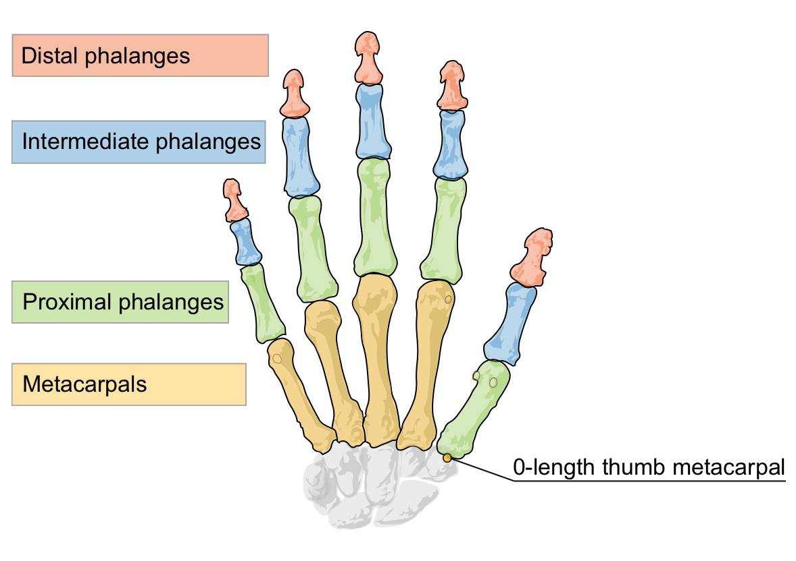

# 骨骼追踪模型概述

2.0 版本的 LeapMotion API 引入了一个全新的骨骼追踪模型来提供更多的手部和手指信息，同时还改善了整体的追踪数据。

<!--Version 2.0 of the Leap Motion API introduces a new skeletal tracking model that provides additional information about hands and fingers and also improves overall tracking data.-->

通过对人手的建模，LeapMotion 可以更好地在不够清晰的环境中预测手指和手部的位置。一只手始终可以显示五根手指，两只手在交叉的过程中也能够被继续被追踪到。当然，控制器依然需要能够检测到一个手指或者手部才可能获得精确的位置，设计你应用程序的交互行为时要时刻注意这点。避免复杂的手势或者非常精细的动作，尤其是那些要求不伸开手指的动作。

<!--By modeling a human hand, the Leap Motion software can better predict the positions of fingers and hands that are not clearly in view. Five fingers are always present for a hand and hands can often cross over each other and still be tracked. Of course, the controller still needs to be able to see a finger or hand in order to accurately report its position. Keep this in mind when designing the interactions used by your application. Avoid requiring complex hand “poses” or subtle motions, especially those involving non-extended fingers.-->

API 的变化可能并不如你所期望的那么大，之前的 API 无论你是否使用新特性都很相似。

增加的内容有：

* 返回基于内部手模型和观测数据的的可信度评级(Confidence Rating)
* 左右手的判定
* 手指的判定
* 返回每一根手指骨头的位置和指向
* 返回手的抓取特征，用于表示用户是在捏还是在抓
* 返回一只手的五根手指
* 返回一只手是伸开与否

也许对于现有程序最为明显的变化是提升了手和手指的连续性。这个将使得支持 LeapMotion 应用的 App 可用性大大提高然而，如果你依赖使用手指弯曲时的消失或触摸特性，那么你需要做一些修改。比如，如果你要统计可见的手指的数目或者区分手指的向外伸展及向内收缩，你需要使用新的 ~~`Pointalbe.isExtended`~~ 属性来得知手指是否伸出。另一方面，如果你依赖于手指互相接触时的消失，你则需要设置指尖的最小的距离阈值，因为手指不会再小时了。

**注意**：`Finger.joint_position()` (在 `Bone` 类中支持)可能会在以后的 SDK 版本中被移除。

## 全新的 Tracking API
新的追踪模型中 API 的变化如下：

### Hand 类
* Hand.confidence
* Hand.is_left
* Hand.is_right
* Hand.grab_strength
* Hand.pinch_strength
* Hand.palm_width
* Hand.basis
* Hand.arm

`Hand.confidence` 是一个 0 到 1 之间的值，表明了内建手部模型和检测数据的匹配程度。数值较低时表示有明显差异；手指位置甚至手部判定都很有可能不正确。可信度这个值对于你程序的价值是随着场景二变化的。手势和动作即使美欧搞的可信度时也能够有效。另一方面，你应该确保，执行由某些手势或者手部属性所触发的程序之前，可信度的值足够高。

<!--
Hand.confidence, a value between 0 and 1, rates how well the internal hand model fits the observed data. A low value indicates that there are significant discrepancies; finger positions, even hand identification could be incorrect. The significance of the confidence value to your application can vary with context. Gestures and motions can be valid even without a high confidence in the hand data. On the other hand, you should make sure the confidence value is high before triggering significant application events based on postures or hand properties.
-->

`Hand.is_left`以及`is_right`的含义是正如它们名字的表示的那样。它们成对出现而且总是有其中一个是`true`。然而 LeapMotion 控制器需要检测到足够的手部信息来获得一个准确的定义。比如，如果你把握紧的拳头放到控制器的视野内，软件可能会出现计算错误。如果软件意识到它的对手的判断出现了错误，则当前这只手会被一个具有新的`id`（以及正确的手指识别）的 Hand 对象所替代。

<!--
Hand.is_left and is_right are self explanatory. One of these will always be true. However, the Leap Motion controller needs to see enough of the hand to make an accurate classification. If, for example, you put your closed fist into the controller field of view, the software has very little to go on and may come to the wrong conclusion. If the software realizes it has misclassified a hand, the current hand is replaced with a Hand object having a new ID value (and corrected finger identification).
-->

`Hand.grab_strength`和`pinch_strength`属性值为 0 到 1 之间。表明了你的手是否是两指间的pinch还是全部手指的 grab 姿势。强度(strength)值接近 0 时说明手是平的，全部手指伸开。对于 grab 姿势而言，强度值增加到 1 说明手已经握成了拳头。而对于 pinch 而言，强度值的增加说明你在把大拇指和某个其他指捏在一起。当强度值超过一定阈值时，你可以使用这些强度属性在你的应用中触发 grabs 或者选择的行为。

<!--
The Hand.grab_strength and pinch_strength properties are values between 0 and 1, indicating whether your hand is in a pinching or grabbing posture. A strength value is close to zero for a hand with flat, extended fingers. For a grab, the strength increases toward 1.0 as you curl your fingers into a fist. For a pinch, the strength increases as you curl the thumb and any finger toward each other. You can use these strength properties to trigger grabs or selections in your application when the value exceeds a certain threshold.
-->

`Hand.palm_width`给出了一个对于手处于平放状态时的手掌宽度的估计。`Hand.basis`是一个方便的用于获取定义手的朝向的标准正交基向量。这三个向量在基矩阵中分贝为手掌法线、手方向、以及它们的向量叉乘。

<!--
Hand.palm_width provides an estimation of the width of the palm when the hand is in a flat position. Hand.basis is a convenience method for getting the orthonormal basis vectors defining the orientation of the hand. The three vectors in the basis matrix are the palm normal, the hand direction, and the cross product between them.
-->

`Hand.arm`提供了有关与手连接的手臂信息。这个属性在整个手臂没有进入检测范围内时，是根据人体解剖学估算出来的。

<!--
Hand.arm provides the information about the forearm to which a hand is attached. The properties of the forearm are estimated based on typical human anatomy when the entire forearm is not in view.
-->

### PointalbeList 和 FingerList 类
* PointableList.extended()
* FingerList.extended()
* FingerList.finger_type()

这个扩展功能返回了被考虑扩展成员的当前序列。这包含了哪些或多或少有指向性的手指及任何的工具。在 `PointableList` 对象中，任何工具都在一个列表中。`finger_type()`函数返回了一个包含所有某类手指的列表（比如所有小拇指、所有食指等）。

<!--The extended functions return the members of the current list that are considered extended. This includes fingers that are more or less pointing straight out from the hand and, in the case of a PointableList object, any tools in the list. The finger_type() function returns all fingers in a list of the specified finger type (i.e all pinkies, all index fingers, etc).-->

### Pointable 和 Finger 类
* Finger.type
* Finger.bone()
* ~~Pointable.isExtended~~

`Finger.type`函数判定手指的名称。返回一个列举数字[0, ..., 4]，分别表示大拇指、食指、中指、无名指以及小拇指。
`Finger.type`函数则返回的 Bone 对象是手指上的某一根骨头。每一个手指，包括拇指，都有四块骨头（即便拇指在解剖学上只有三块骨头）。

<!--The Finger.type function identifies the finger name. The values returned are an enumeration, [0..4], representing: thumb, index, middle, ring, and pinky. The Finger.bone() function returns the Bone object representing the specified bone of a finger. Each digit, including the thumb, has four defined bones – including the thumb (even though it only has three anatomical bones).-->

注意，`Pointable.direction`平行于指根和指尖的连线之间的连线。它不一定平行于手指这个手指的最后一根骨头（Distal Phalanx）。手指越弯曲，两个方向的差异就越大。这个计算 `Pointable.direction`的方法和早期版本的 API 保持一致，但是如果你的的项目是从手沿`Pointable.direction`方向发射一条射线，会有点诡异。

<!--Note that |Pointable.direction|_ is parallel to the line running between the base and the tip of the finger. It is not necessarily parallel to the last bone of the finger (the distal phalanx). The more a finger is curved, the greater the difference between the two directions will be. This method of calculating Pointable.direction is consistent with earlier versions of the API, but may look odd if you project a ray from a visual representation of the hand along the |Pointable.direction|.-->

### Bone 类
Bone 类描述了手指上的每一个骨头的位置和朝向，包括连接了手指和手掌根部的 Metacrapal。

<!--
New Bone class
The Bone class describes be position and orientation of each of the bones of a finger as well as the metacarpal bones, which connect the fingers to the base of the hand.
-->

* Bone.basis
* Bone.direction
* Bone.invalid
* Bone.is_valid
* Bone.length
* Bone.prev_joint
* Bone.next_joint
* Bone.type
* Bone.width

### Arm 类
Arm 类和 Bone 类相似，给出了手前臂的物理位置以及基向量，具体描述了手臂在空间中的指向。

<!--
New Arm class
The Arm class, similar in structure to the Bone class, provides the physical positions of the end points of the forearm as well as basis vectors specifying how the arm is oriented in space.
-->

* Arm.basis
* Arm.direction
* Arm.elbow_position
* Arm.invalid
* Arm.is_valid
* Arm.width
* Arm.wrist_position

### JSON 数据变化
新的追踪模型可以通过 LeapMotion WebSocket 界面来反应追踪。和本地 API相比，你可能注意到了最大的不同就在于现在的手始终有五根手指了。

<!--JSON data changes
The new tracking model is also reflected in the tracking data supplied via the Leap Motion WebSocket interface. As with the native API, the biggest difference you are likely to notice in existing applications is that hands will always have 5 fingers now.-->

使用 `v6.json` 端点(ws://127.0.0.1:6437/v6.json)可以访问新的 API 特性。

<!--To access the new API features, use the v6.json endpoint (ws://127.0.0.1:6437/v6.json).-->

一帧中手的数组的每只手都有以下属性：

<!--Each hand in the frame hands array has the following new properties:-->

* `armWidth` ——手前臂的平均宽度
* `confidence` ——骨骼模型和观测数据的吻合度
* `elbow` ——胳膊肘的位置
* `grabStrength` —— 0 到 1 之间的一个值
* `pinchStrength` —— 0 到 1 之间的一个值
* `type` ——表明一个手是左手还是右手
* `wrist` ——手腕的位置

<!--
armWidth – the average width of the forearm.
confidence – indicates how well the skeleton model and the observed data fit.
elbow – the position of the elbow of the arm to which the hand is attached
grabStrength – a value between 0 and 1.
pinchStrength – a value between 0 and 1.
type – a string indicating whether the hand is a left or a right hand.
wrist – the position of the wrist
-->

一帧中的可指向物数组中的每一个手指都有以下属性：

<!--Each finger in the frame pointables array has the following new properties:-->

* `type` ——表示手指名称的整数
* `bases` ——每个骨头的基向量，索引顺序从手腕到指尖
* `btipPosition` —— Distal Phalanx 的最远端位置（指尖？），是一个包含三个浮点数的数组。
* `carpPosition` —— Metacarpal 基点的位置，得到的是一个包含三个浮点数的数组。
* `dipPosition` —— Distal Phalanx 的基点的位置，得到一个包含三个浮点数的数组。
* `pipPosition` ——包含三个浮点数的位置向量
* `mcpPosition` ——包含三个浮点数的位置向量
* `extended` ——某根手指指向与否的布尔值。

<!--
type – an integer code for the finger name.
bases – the basis vectors for each bone, in index order (wrist to tip).
btipPosition – position of the extreme end of the distal phalanx as an array of 3 floating point numbers.
carpPosition – position of the base of metacarpal bone as an array of 3 floating point numbers.
dipPosition – position of the base of the distal phalanx as an array of 3 floating point numbers.
pipPosition – a position vector as an array of 3 floating point numbers
mcpPosition – a position vector as an array of 3 floating point numbers
extended – a boolean indicating whether the finger is pointing or not.
-->