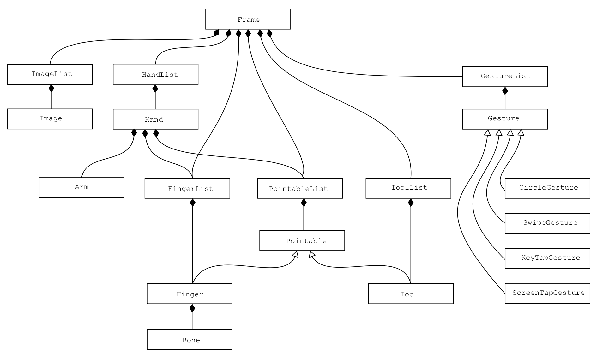

# 追踪模型

LeapMotion API 定义了一系列类来表示每个主要的追踪对象。




## [Frame](../api/Leap.Frame.md)

Frame 是数据模型的基础，提供所有追踪对象实体的访问。每隔一个时间间隔都会创建一个新的 Frame。

帧包含了手、手指、工具以及在当前帧追踪的手势的列表。（你还可以从 Hand 对象关联的特定手中获取手指。）

## [Hand](../api/Leap.Hand.md)

Hand 对象描述了一只手的位置和方向。通过在帧和包含那只手所关联的手指的列表之间追踪它的动作。

```python
# 手是一个 Leap.Hand 对象
pointables = hand.pointables
fingers = hand.fingers
```

## [Arm](../api/Leap.Arm.md)

Arm 对象描述了一只手所附加的手臂的位置和方向。手臂只能通过 Hand 对象来访问。

## [Pointable](../api/Leap.Pointable.md)、[Finger](../api/Leap.Finger.md)、[Tool](../api/Leap.Tool.md)

Pointable 对象为手指和工具定义了基本特征。Finger 和 Tool 类从 Pointable 类扩展而来，为这些实体增加了特定的信息。

```python
if (pointable.is_tool):
    tool = Leap.Tool(pointable)
else:
    finger = Leap.Finger(pointable)
```

## [Bone](../api/Leap.Bone.md)

Bone 对象表示骨头的位置和方向。被追踪的骨头包括手指的 Metarcapals 和 Phalanges 骨。

<!--Bone object represent the position and orientation of a bone. The tracked bones include the metarcarpals and phalanges of the fingers (and thumb).-->

## [Gesture](../api/Leap.Gesture.md)

Gesture 类和他的子类表示了 LeapMotion 软件所能识别的四中不同的手势。

<!--The Gesture class and its subclasses represent a snapshot of one of the four gestures recognized by the Leap Motion software.

See Gestures-->

## [Image](../api/Leap.Image.md)

Image 对象提供了 LeapMotion 摄像头的原始传感器数据以及一个校准镜头畸变的网络（不能通过 WebSocket 服务获取）。

<!--Image objects provide the raw sensor data and calibration grid for the Leap Motion cameras. (Not available through the WebSocket server.)-->

## 追踪目标的列表

帧和手对象以及其他追踪物体的列表。

[HandList](../api/Leap.HandList.md)、[PointableList](../api/Leap.PointableList.md)、[FingerList](../api/Leap.FingerList.md) 以及 [ToolList](../api/Leap.ToolList.md) 提供了一些便捷的函数和列表成员过滤器。例如，`frontmost()`函数返回的是 LeapMotion 控制器视野中最前面放的物体（z 轴值最小的物体）。

<!--The Frame and Hand objects contain lists of the other tracked objects.

HandList, PointableList, FingerList, and ToolList classes provide a few convenience functions for filtering the list members. For example, the frontmost() function returns the item that is the most forward in the Leap Motion controller’s field of view (smallest z value).-->

## 工具类
[Vector](../api/Leap.Vector.md) 类描述了点和方向，Vector 类还提供了一些有用的数学函数用来处理向量。

同样，[Matrix](../api/Leap.Matrix.md) 类描述了类似旋转的变换，通过一些 API 函数来返回。

[InteractionBox](../api/Leap.InteractionBox.md) 类帮助LeapMotion 控制器视野的一部分直线映射到二维屏幕空间或者三维空间。参考[模拟触摸](Leap_Touch_Emulation.md)。

<!--The Vector class describes points and directions. The Vector class also provides several useful math functions for working with vectors.

Likewise, the Matrix class represents things like rotations and other transforms returned by some functions in the API.

The InteractionBox class provides functions to help map a rectilinear portion of the Leap Motion controller’s field of view to either 2D screen space or 3D space. See Touch Emulation.-->